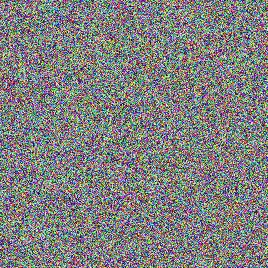

# 基于SM4-ECB、CBC模式的图片加解密
## 实现思路
加密：将jJPG图片转化为rgba图像，然后使用sm4算法对其进行加密，再将加密后的RGBA图片转换回JPG图片
解密：将加密后的JPG图片转为RGBA格式图片，再使用sm4算法进行解密，解密后再将其转回JPG图片

## 具体实现过程
### 1.图片格式转化

使用Python的PIL包 实现JPG转RGBA和RGBA转JPG
```Python
from PIL import Image
import numpy as np
path = 'encrypt_image/peking_logo.jpg'
image = Image.open(path)
out = image.convert("RGBA")
out.save('peking_logo.rgba')

rgba_path = 'encrypt_image/peking_logo.jpg'
```

使用Python的PIL包，实现RGBA转JPG
```Python
from PIL import Image
import numpy as np
L_path='encrypt_image/peking_logo.jpg'
L_image=Image.open(L_path)
out = L_image.convert("RGBA")
out.save('peking_logo.rgba')
```
使用ImageMagick将加密后的RGBA图转化为JPG图
```bash
convert -size 268x268 -depth 8 peking_logo_ecb_dec.rgba peking_logo_ecb_dec.jpg
```

### 2.图片加密
#### 2.1 安装gmssl
首先编译安装openssl
```bash
sudo yum install libtool perl-core zlib-devel -y
curl -O -L https://github.com/openssl/openssl/archive/OpenSSL_1_1_0g.tar.gz
tar -zxvf OpenSSL_1_1_0g.tar.gz
cd openssl-OpenSSL_1_1_0g
sudo ./config --prefix=/usr/local/openssl --openssldir=/usr/local/openssl shared zlib
sudo make
make test
sudo make install
```
配置openssl
```bash
sudo vi /etc/profile.d/openssl.sh
```
添加以下内容
```bash
pathmunge /usr/local/openssl/bin
```
openssl安装完成,可查看openssl版本
```bash
sudo ldconfig -v
openssl version
```

接下来安装Gmssl
```bash
git clone https://github.com/guanzhi/GmSSL.git
cd GmSSL
./config
sudo make 
sudo make install
gmssl version
```

####2.2 基于ECB模式的加解密

加密
```bash
gmssl enc -sms4-ecb -e -in peking_logo.rgba -out peking_logo_ecb.rgba
```
解密
```bash
gmssl sms4-ecb -d -in peking_logo_ecb.rgba -out peking_logo_ecb_dec.rgba
```
####2.3 基于CBC模式的加密

加密
```bash
gmssl enc -sms4-cbc -e -in peking_logo.rgba -out peking_logo_cbc.rgba
```
解密
```bash
gmssl sms4-cbc -d -in peking_logo_cbc.rgba -out peking_logo_cbc_dec.rgba
```

###3.运行结果

####3.1 基于ECB模式的加解密


####3.2 基于CBC模式的加解密

